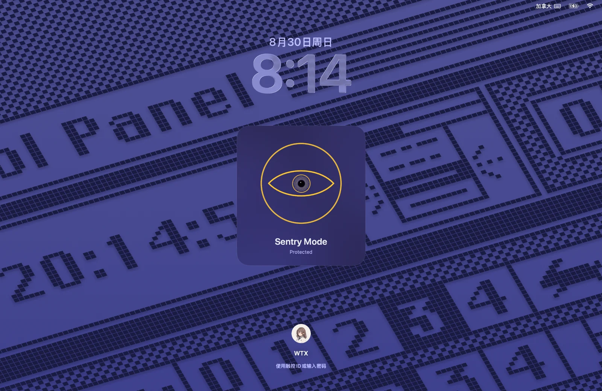

# Sentinel / 哨兵

<p align="center">
  <strong>A privacy-first macOS sentry that watches your Mac while you're away.</strong>
</p>

<p align="center">
  <a href="https://github.com/Allen-ux-dev/Sentinel/releases/latest">
    
  </a>
  
  <a href="./LICENSE">
    
  </a>
  
</p>

<p align="center">
  
</p>

Sentinel is a native macOS security companion designed for the moments when you leave your Mac unattended.

Instead of replacing the macOS Lock Screen, Sentinel lets macOS continue handling the real password and Touch ID authentication while adding a lightweight monitoring layer and a calm, vector-drawn **Sentry Eye** that visually reacts to activity.

**哨兵（Sentinel）** 是一个原生 macOS 安全伴随工具。

它不是一个假的锁屏，也不会自己处理密码。真正的密码与 Touch ID 认证仍然完全由 macOS 负责。

Sentinel 做的是：当你离开电脑后，让 Mac 继续处于监测状态，并通过一只实时矢量绘制的“哨兵之眼”把当前状态表现出来。

---

## Why Sentinel? / 为什么做 Sentinel？

Sometimes you only leave your Mac for a few minutes.

You may be in a classroom, library, office, coffee shop, or another shared environment. You lock the screen, walk away, and when you return there is usually no easy way to know whether anything happened while you were gone.

Sentinel is designed around a simple idea:

> **When you are away, let the Mac keep watch.**

当你离开电脑以后，普通锁屏只能阻止别人直接进入系统，但它通常不会告诉你：

- 有没有人尝试解锁电脑
- 有没有插入或拔出 USB 设备
- 网络有没有发生变化
- 电源有没有被拔掉
- Mac 有没有睡眠或被唤醒
- Sentinel 自己的监测服务有没有异常中断

Sentinel 会把这些事件整理成本地时间线。

如果系统能够检测到认证失败，还可以让哨兵之眼作出反应，并可选择捕获一张当时摄像头看到的静态画面。

---

## The Sentry Eye / 哨兵之眼

The central visual element of Sentinel is not a photo or a realistic eyeball.

It is drawn in real time using SwiftUI Canvas, Bézier curves, Core Graphics, and animation state.

哨兵之眼是 Sentinel 最核心的交互设计。

它不是 GIF，也不是写实眼球图片，而是实时绘制的动态图形。

It can:

- breathe slowly while idle
- blink naturally
- occasionally double-blink
- move its iris slightly toward the cursor
- constrict or expand its pupil
- squint during alert states
- glance sideways
- react differently to different events
- avoid repeating the same reaction too frequently

眼珠的移动范围会根据当前眼皮开合程度自动限制。

即使在眨眼、半眯或警觉状态下，虹膜和瞳孔也会被限制在眼睑范围内，不会穿出眼皮。

---

## Features / 功能

### Lock Screen Companion

Sentinel works alongside the real macOS Lock Screen.

macOS remains responsible for:

- password authentication
- Touch ID
- user accounts
- session unlocking
- Secure Enclave interaction

Sentinel never implements its own password field.

### System Event Monitoring

Sentinel can monitor local system events such as:

- network connectivity changes
- power connection changes
- USB device connection and removal
- sleep and wake
- lock and unlock state
- Sentinel runtime/watchdog status

这些事件默认只保存在本机。

### Local Event Timeline / 本地行为记录

Sentinel keeps a local event history.

For example:

```text
20:14:22  Sentry Mode armed
20:16:03  Network disconnected
20:16:07  Network restored
20:18:41  Authentication failure
20:18:43  Capture saved
20:20:02  Mac unlocked
```

Default retention: **7 days**.

The retention period can be changed in Settings.

### Authentication Failure Reactions

When an authentication failure can be detected, the Sentry Eye can select from multiple reactions instead of repeating the same animation every time.

Examples include:

- pupil constriction
- single blink
- double blink
- squint
- short gaze shift
- slight eye recoil
- ring ripple
- focus animation
- low-probability idle-style reactions

A recent-reaction exclusion pool reduces repetitive behavior.

### Alert State

By default:

```text
3 authentication failures
within 2 minutes
        ↓
High Alert
        ↓
10 seconds
        ↓
Low Alert
        ↓
until successful authentication
```

These values can be changed in Settings.

Normal system events remain silent. A true alert can play one short notification sound.

---

## Authentication Failure Detection

> [!IMPORTANT]
> Authentication-failure detection is currently experimental.

macOS does **not** provide third-party applications with a stable public API that reports every failed Lock Screen password or Touch ID attempt.

Sentinel therefore uses a narrow experimental result-monitoring adapter. It attempts to recognize authentication-result events exposed by the system, but availability can vary between macOS versions.

Sentinel will **not** fall back to password interception or keyboard logging if the system does not expose a reliable event.

Sentinel does not record:

- passwords
- password length
- keyboard input
- keystrokes
- Touch ID fingerprint data
- Secure Enclave contents

诊断页面中也提供模拟认证失败/成功事件的功能，用于单独测试 Sentinel 的状态机与眼睛动画。

---

## Authentication Failure Capture / 认证失败画面捕获

Sentinel can optionally capture **one still image** when an authentication failure is detected while Sentry Mode is armed.

This feature is **OFF by default** and must be explicitly enabled by the user.

When enabled, Sentinel requests the normal macOS Camera permission. Sentinel does not attempt to hide the system camera-use indicator.

### Capture behavior

```text
Authentication failure
        ↓
Start camera
        ↓
Camera warm-up
        ↓
Auto exposure / white balance
        ↓
Capture one image
        ↓
Dark-frame validation
        ↓
Optional retry
        ↓
JPEG compression
        ↓
Stop camera
```

Default image settings:

```text
Maximum size: 960 × 540
Format: JPEG
Retention: 7 days
Storage limit: 250 MB
```

Old captures are automatically removed when the configured limit is exceeded.

Captured images are stored locally under:

```text
~/Library/Application Support/Sentinel/Captures/
```

The Events page can show:

```text
Authentication failure        [View Capture]
```

Sentinel also includes a dedicated **Captures / 捕获画面** page for viewing and deleting saved images.

Sentinel does not perform:

- continuous video recording
- audio recording
- face recognition
- cloud upload
- biometric analysis

---

## Watchdog / Helper

Sentinel includes a lightweight watchdog helper. The main application periodically writes a heartbeat.

```text
Sentinel
   │
   │ heartbeat
   ▼
SentinelHelper
   │
   └── checks runtime health
```

If monitoring unexpectedly stops, Sentinel can attempt automatic recovery.

Default recovery policy:

```text
Maximum 3 restart attempts
within 5 minutes
```

This prevents an infinite crash/restart loop. Normal user shutdown is distinguished from abnormal termination.

---

## Privacy

Sentinel is designed around local-first monitoring.

By default:

- event history stays on the Mac
- captures stay on the Mac
- no cloud backend is required
- no account is required
- no password content is collected
- no Touch ID biometric data is collected
- no microphone recording is performed
- no remote camera access exists in v0.1

Sentinel 尽量遵循：

> **只收集完成功能真正需要的数据。**

---

## Languages / 语言

Sentinel currently supports:

- System Language
- English
- 简体中文

The language can be changed directly inside Settings.

---

## Download / 下载

Download the latest version from:

### [GitHub Releases](https://github.com/Allen-ux-dev/Sentinel/releases/latest)

Current release: **Sentinel v0.1.0**

Download:

```text
Sentinel-v0.1.0-macOS.zip
```

---

## Installation / 安装

Extract the release archive. Inside you will find:

```text
Sentinel.app
Install.command
```

Double-click:

```text
Install.command
```

The installer verifies that the app bundle belongs to Sentinel and installs it to:

```text
/Applications/Sentinel.app
```

If an older Sentinel installation already exists, the installer temporarily backs it up. If installation fails, the previous version is restored.

---

## Build from Source / 从源码构建

Requirements:

- macOS 13+
- Swift 5.9+
- Xcode / Swift toolchain
- Internet access during the first dependency resolution

Clone:

```bash
git clone https://github.com/Allen-ux-dev/Sentinel.git
cd Sentinel
```

Build and install:

```bash
chmod +x Build.command
./Build.command
```

`Build.command` performs:

```text
Source validation
        ↓
Core tests
        ↓
Release build
        ↓
App bundle assembly
        ↓
Icon generation
        ↓
Ad-hoc signing
        ↓
Signature verification
        ↓
Safe /Applications install
        ↓
Watchdog Helper installation
        ↓
Launch Sentinel
```

The installed location is:

```text
/Applications/Sentinel.app
```

User data is kept under:

```text
~/Library/Application Support/Sentinel
```

Updating Sentinel does not intentionally remove that directory.

---

## Permissions

### Accessibility

Used for automatic Lock Screen activation.

Without it, you can still manually lock your Mac with:

```text
Control + Command + Q
```

### Camera

Only required if **Authentication Failure Capture** is explicitly enabled. Camera access is optional.

---

## Architecture

```text
macOS Events
     │
     ▼
Runtime Monitors
     │
     ▼
SentryEventBus
   ┌─┴───────────────┐
   ▼                 ▼
Event Store     Eye State Manager
                      │
                      ▼
                Reaction Pool
                      │
                      ▼
                  EyeView
```

Major components include:

```text
NetworkMonitor
PowerMonitor
USBMonitor
SessionMonitor
AuthenticationOutcomeMonitor
CameraCaptureService
HeartbeatWriter
SentinelHelper
EyeStateManager
EyeAnimationController
EyeMotionController
ReactionPool
```

---

## Inspiration & Attribution / 灵感来源与致谢

Sentinel was **not designed in a vacuum**.

The original inspiration came from:

### [Lakr233/Sentry](https://github.com/Lakr233/Sentry)

Sentry explores the idea of leaving a security monitor active while the owner temporarily steps away from a Mac.

That idea inspired Sentinel to explore a different interaction direction:

> Turning security-monitoring state into a calm, visible, living interface.

Sentinel also uses:

### [Lakr233/SkyLightWindow](https://github.com/Lakr233/SkyLightWindow)

SkyLightWindow provides a Swift-friendly way to work with high-level macOS windows using private SkyLight APIs. Sentinel uses it for its lock-screen presentation layer.

Both **Sentry** and **SkyLightWindow** are projects by Lakr Aream and are distributed under the MIT License.

Sentinel itself is a separate implementation. Its own design includes:

- the circular vector Sentry Eye
- breathing and blinking behavior
- cursor gaze
- pupil contraction
- reaction pools
- Sentinel event state machine
- bilingual UI
- watchdog architecture
- local event timeline
- authentication-failure capture workflow

中文：

Sentinel 的最初灵感来自 **Lakr233 的 Sentry**。

Sentry 提出了一个很有意思的思路：

> 当用户暂时离开 Mac 时，让电脑继续处于一个主动的安全监测状态。

同时，Lakr233 的 **SkyLightWindow** 展示了通过 macOS SkyLight 机制实现高层级自定义窗口的可能性。

Sentinel 在这些灵感基础上选择了自己的方向：

**把后台安全状态变成一只真正“活着”的哨兵之眼。**

项目会明确保留这些灵感来源和第三方依赖的署名。

For additional attribution information, see [`THIRD_PARTY_NOTICES.md`](THIRD_PARTY_NOTICES.md) and [`NOTICE`](NOTICE).

---

## Private API Notice

Sentinel uses functionality that depends on macOS private SkyLight behavior through SkyLightWindow.

Private APIs may change in future macOS releases.

The project attempts to isolate this functionality so that failure of the visual overlay does not compromise the normal macOS Lock Screen or the rest of Sentinel's monitoring architecture.

---

## Security Boundary

Sentinel must never become responsible for authentication.

The following rules are intentional design boundaries:

- macOS owns password verification
- macOS owns Touch ID
- Sentinel does not replace LoginWindow
- Sentinel does not create a fake password field
- Sentinel does not intercept password input
- Sentinel does not store biometric information
- Sentinel's overlay must never prevent normal system unlocking

---

## Roadmap

Possible future directions include:

- improved authentication-result compatibility
- richer event reactions
- additional Sentry Eye themes
- more detailed local event inspection
- stronger runtime health diagnostics
- multi-display improvements
- optional local-network companion features

New monitoring capabilities will be evaluated with privacy and security boundaries in mind.

---

## License

Sentinel is released under the **Apache License 2.0**. See [`LICENSE`](LICENSE).

Third-party dependencies and referenced projects retain their original licenses and copyright notices.

In particular:

- Lakr233/Sentry — MIT License
- Lakr233/SkyLightWindow — MIT License

---

## Developer

**Allen-ux-dev**

GitHub: <https://github.com/Allen-ux-dev>

---

<p align="center">
  <strong>Sentinel — Let your Mac keep watch while you're away.</strong>
</p>
